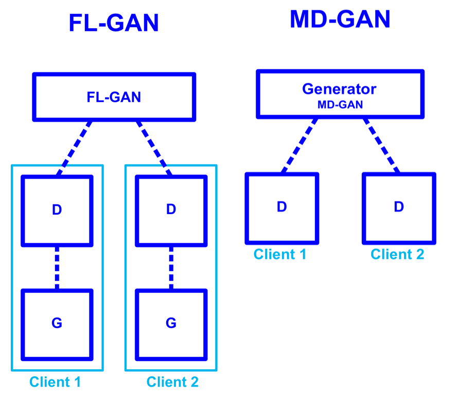

# Federated-Distributed-GAN

This project is an adaptation of https://arxiv.org/abs/1811.03850 and novel encryption based solutions.

## Supported Architectures

## Experiments

### Distributed Federated Learning
#### Prerequisites
- MPI
- Cifar10
- GPU
- Pytorch

#### Architecture Support
- FLGAN

#### How to run?
 - `run pip install pytorch_requirements.txt`
 - `run command 'mpiexec -n 3 pytorch/DistributedGanPytorch_fixed.py' from root`for classic FL-GAN
#### Limitations
   - `Currently only works for 3 clients`

#### Results

### Distributed Federated Learning 

#### Prerequisites
- Ray
- MNIST
- FMNIST
- GPU
- CPU
- Tensorflow

#### Architecture Support
- FLGAN
- MDGAN
- MULTI-FLGAN

#### How to run?
 - `run pip install tensorflow_requirements.txt`
 - `update the distribution, generator and discriminator size in tensorflow/DistrubtedGanTensorflow.py`
 - `run main.py`

#### Results

### Offline Distributed Federated Learning 
#### Prerequisites
- MNIST
- FMNIST
- Tensorflow

#### Architecture Support
- FLGAN
- MDGAN
- MULTI-FLGAN

#### How to run?
 - `run pip install tensorflow_requirements.txt`
 - `update the distribution, generator and discriminator size in offline-Federaredlearning/DistrubtedGanTensorflow.py`
 - `run main.py`

#### Results

### Encryted Federated Learning 
#### Prerequisites
- MPI
- Cifar10
- GPU
- Pytorch

#### Architecture Support
- FLGAN

#### How to run?
 - `run pip install pytorch_requirements.txt`
 - `run command 'mpiexec -n 3 pytorch/DistributedGanPytorch_fixed_paillier.py' from root`for FL-GAN with additive homomorphic encryption
 - `run command 'mpiexec -n 3 pytorch/DistributedGanPytorch_fixed_crypten.py' from root`for FL-GAN with multi-party computation
#### Limitations
   - `Currently only works for 3 clients

#### Results

### HPC support 
 - `run the commands under slurm`

