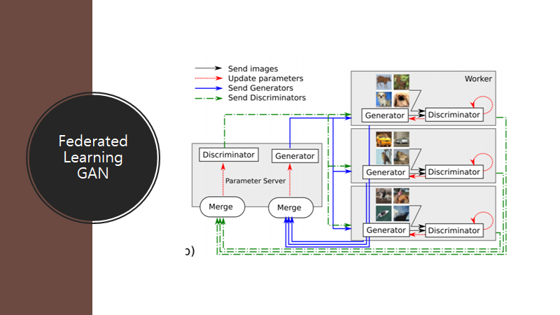
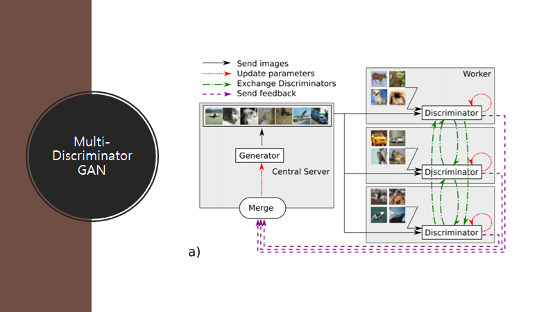
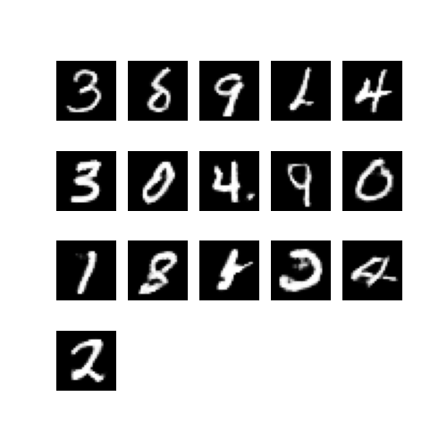

# DistributedGAN
DistributedFederatedGAN

Using Tensorflow, Ray, Python

for research project

based on  https://arxiv.org/abs/1811.03850

Implementation of unique architure with FedAvg and MDGan alg:

    

usage:

    - run pip install pytorch_requirements.txt
    - run main file in DistributedGanPytorch
    
                            or
    
    - run pip install tensorflow_requirements.txt
    - run main file in DistributedGanTensorflow

Final Result (1 disc, 1 gen, 1 FL):
     
